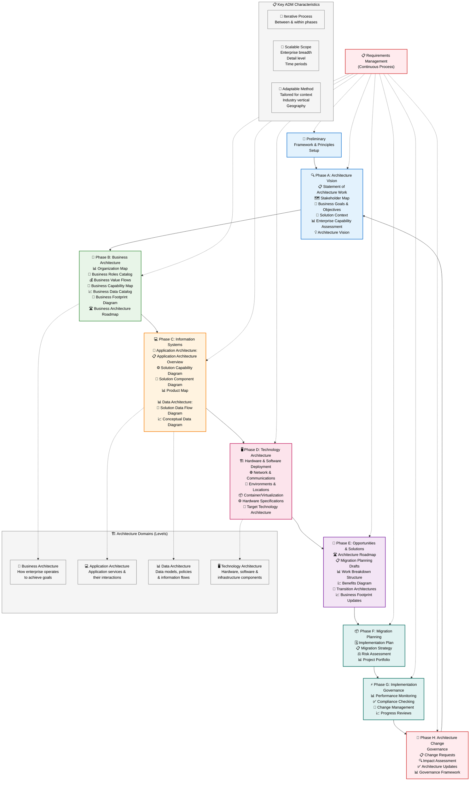

```mermaid
graph TB
    %% Central Requirements Management
    ReqMgmt["📋 Requirements Management<br/>(Continuous Process)"]
    
    %% ADM Phases in circular arrangement
    Prelim["🎯 Preliminary<br/>Framework & Principles<br/>Setup"]
    
    PhaseA["🔍 Phase A: Architecture Vision<br/>📋 Statement of Architecture Work<br/>🗺️ Stakeholder Map<br/>🎯 Business Goals & Objectives<br/>📄 Solution Context<br/>📊 Enterprise Capability Assessment<br/>💡 Architecture Vision"]
    
    PhaseB["🏢 Phase B: Business Architecture<br/>📊 Organization Map<br/>👥 Business Roles Catalog<br/>💰 Business Value Flows<br/>🎯 Business Capability Map<br/>📈 Business Data Catalog<br/>👣 Business Footprint Diagram<br/>🛣️ Business Architecture Roadmap"]
    
    PhaseC["💻 Phase C: Information Systems<br/>🔧 Application Architecture:<br/>📋 Application Architecture Overview<br/>⚙️ Solution Capability Diagram<br/>🧩 Solution Component Diagram<br/>📊 Product Map<br/><br/>📊 Data Architecture:<br/>🔄 Solution Data Flow Diagram<br/>📈 Conceptual Data Diagram"]
    
    PhaseD["🖥️ Phase D: Technology Architecture<br/>🏗️ Hardware & Software Deployment<br/>🌐 Network & Communications<br/>📍 Environments & Locations<br/>📦 Container/Virtualization<br/>⚙️ Hardware Specifications<br/>🎯 Target Technology Architecture"]
    
    PhaseE["🚀 Phase E: Opportunities & Solutions<br/>🛣️ Architecture Roadmap<br/>📋 Migration Planning Drafts<br/>📊 Work Breakdown Structure<br/>💹 Benefits Diagram<br/>🔄 Transition Architectures<br/>📈 Business Footprint Updates"]
    
    PhaseF["📦 Phase F: Migration Planning<br/>🗓️ Implementation Plan<br/>📋 Migration Strategy<br/>⚖️ Risk Assessment<br/>📊 Project Portfolio"]
    
    PhaseG["⚡ Phase G: Implementation<br/>Governance<br/>📊 Performance Monitoring<br/>✅ Compliance Checking<br/>🔄 Change Management<br/>📈 Progress Reviews"]
    
    PhaseH["🔄 Phase H: Architecture Change<br/>Governance<br/>📋 Change Requests<br/>🔍 Impact Assessment<br/>✅ Architecture Updates<br/>📊 Governance Framework"]
    
    %% Circular flow
    Prelim --> PhaseA
    PhaseA --> PhaseB
    PhaseB --> PhaseC
    PhaseC --> PhaseD
    PhaseD --> PhaseE
    PhaseE --> PhaseF
    PhaseF --> PhaseG
    PhaseG --> PhaseH
    PhaseH --> PhaseA
    
    %% Requirements Management connects to all phases
    ReqMgmt -.-> Prelim
    ReqMgmt -.-> PhaseA
    ReqMgmt -.-> PhaseB
    ReqMgmt -.-> PhaseC
    ReqMgmt -.-> PhaseD
    ReqMgmt -.-> PhaseE
    ReqMgmt -.-> PhaseF
    ReqMgmt -.-> PhaseG
    ReqMgmt -.-> PhaseH
    
    %% Architecture Domains Box
    subgraph Domains ["🏗️ Architecture Domains (Levels)"]
        Business["🏢 Business Architecture<br/>How enterprise operates<br/>to achieve goals"]
        Application["💻 Application Architecture<br/>Application services &<br/>their interactions"]
        Data["📊 Data Architecture<br/>Data models, policies<br/>& information flows"]
        Technology["🖥️ Technology Architecture<br/>Hardware, software &<br/>infrastructure components"]
    end
    
    %% Key Characteristics
    subgraph Characteristics ["📋 Key ADM Characteristics"]
        Iterative["🔄 Iterative Process<br/>Between & within phases"]
        Scalable["📏 Scalable Scope<br/>Enterprise breadth<br/>Detail level<br/>Time periods"]
        Adaptable["🔧 Adaptable Method<br/>Tailored for context<br/>Industry vertical<br/>Geography"]
    end
    
    %% Connect domains to relevant phases
    PhaseB -.-> Business
    PhaseC -.-> Application
    PhaseC -.-> Data
    PhaseD -.-> Technology
    
    %% Styling
    classDef visionStyle fill:#e3f2fd,stroke:#1976d2,stroke-width:2px,color:#000
    classDef businessStyle fill:#e8f5e8,stroke:#388e3c,stroke-width:2px,color:#000
    classDef systemsStyle fill:#fff3e0,stroke:#f57c00,stroke-width:2px,color:#000
    classDef techStyle fill:#fce4ec,stroke:#c2185b,stroke-width:2px,color:#000
    classDef solutionStyle fill:#f3e5f5,stroke:#7b1fa2,stroke-width:2px,color:#000
    classDef implementStyle fill:#e0f2f1,stroke:#00695c,stroke-width:2px,color:#000
    classDef mgmtStyle fill:#ffebee,stroke:#d32f2f,stroke-width:2px,color:#000
    classDef domainStyle fill:#f5f5f5,stroke:#616161,stroke-width:1px,color:#000
    
    class Prelim,PhaseA visionStyle
    class PhaseB businessStyle
    class PhaseC systemsStyle
    class PhaseD techStyle
    class PhaseE solutionStyle
    class PhaseF,PhaseG implementStyle
    class PhaseH,ReqMgmt mgmtStyle
    class Domains,Business,Application,Data,Technology,Characteristics,Iterative,Scalable,Adaptable domainStyle
```
