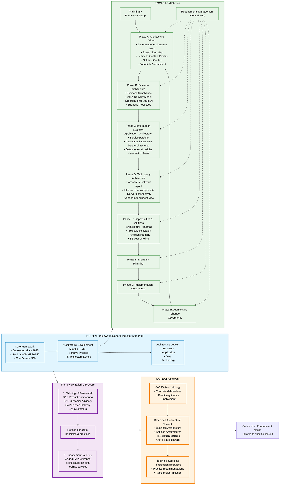

```mermaid
graph LR
    %% TOGAF Foundation
    subgraph TOGAF ["TOGAF® Framework (Generic Industry Standard)"]
        TOG_Core["Core Framework<br/>- Developed since 1995<br/>- Used by 80% Global 50<br/>- 60% Fortune 500"]
        TOG_ADM["Architecture Development<br/>Method (ADM)<br/>- Iterative Process<br/>- 4 Architecture Levels"]
        TOG_Levels["Architecture Levels:<br/>• Business<br/>• Application<br/>• Data<br/>• Technology"]
        
        TOG_Core --> TOG_ADM
        TOG_ADM --> TOG_Levels
    end
    
    %% Tailoring Process
    subgraph Tailoring ["Framework Tailoring Process"]
        T1["1. Tailoring of Framework<br/>SAP Product Engineering<br/>SAP Customer Advisory<br/>SAP Service Delivery<br/>Key Customers"]
        T2["Refined concepts,<br/>principles & practices"]
        T3["2. Engagement Tailoring<br/>Added SAP reference<br/>architecture content,<br/>tooling, services"]
        
        T1 --> T2
        T2 --> T3
    end
    
    %% SAP EA Framework
    subgraph SAP_EA ["SAP EA Framework"]
        SAP_Method["SAP EA Methodology<br/>- Concrete deliverables<br/>- Practice guidance<br/>- Enablement"]
        SAP_Content["Reference Architecture Content:<br/>• Business Architecture<br/>• Solution Architectures<br/>• Integration patterns<br/>• APIs & Middleware"]
        SAP_Tools["Tooling & Services:<br/>• Professional services<br/>• Practice recommendations<br/>• Rapid project initiation"]
        
        SAP_Method --> SAP_Content
        SAP_Content --> SAP_Tools
    end
    
    %% ADM Phases Detail
    subgraph ADM_Detail ["TOGAF ADM Phases"]
        Prelim["Preliminary<br/>Framework Setup"]
        PhaseA["Phase A: Architecture Vision<br/>• Statement of Architecture Work<br/>• Stakeholder Map<br/>• Business Goals & Drivers<br/>• Solution Context<br/>• Capability Assessment"]
        PhaseB["Phase B: Business Architecture<br/>• Business Capabilities<br/>• Value Delivery Model<br/>• Organizational Structure<br/>• Business Processes"]
        PhaseC["Phase C: Information Systems<br/>Application Architecture:<br/>• Service portfolio<br/>• Application interactions<br/>Data Architecture:<br/>• Data models & policies<br/>• Information flows"]
        PhaseD["Phase D: Technology Architecture<br/>• Hardware & Software layout<br/>• Infrastructure components<br/>• Network connectivity<br/>• Vendor-independent view"]
        PhaseE["Phase E: Opportunities & Solutions<br/>• Architecture Roadmap<br/>• Project identification<br/>• Transition planning<br/>• 3-5 year timeline"]
        PhaseF["Phase F: Migration Planning"]
        PhaseG["Phase G: Implementation Governance"]
        PhaseH["Phase H: Architecture Change<br/>Governance"]
        ReqMgmt["Requirements Management<br/>(Central Hub)"]
        
        Prelim --> PhaseA
        PhaseA --> PhaseB
        PhaseB --> PhaseC
        PhaseC --> PhaseD
        PhaseD --> PhaseE
        PhaseE --> PhaseF
        PhaseF --> PhaseG
        PhaseG --> PhaseH
        PhaseH --> PhaseA
        
        ReqMgmt -.-> PhaseA
        ReqMgmt -.-> PhaseB
        ReqMgmt -.-> PhaseC
        ReqMgmt -.-> PhaseD
        ReqMgmt -.-> PhaseE
        ReqMgmt -.-> PhaseF
        ReqMgmt -.-> PhaseG
        ReqMgmt -.-> PhaseH
    end
    
    %% Final Output
    ArchEngagement["Architecture Engagement Needs<br/>Tailored to specific context"]
    
    %% Connections
    TOGAF --> Tailoring
    Tailoring --> SAP_EA
    SAP_EA --> ArchEngagement
    TOG_ADM -.-> ADM_Detail
    
    %% Styling
    classDef togafStyle fill:#e1f5fe,stroke:#0277bd,stroke-width:2px,color:#000
    classDef sapStyle fill:#fff3e0,stroke:#f57c00,stroke-width:2px,color:#000
    classDef processStyle fill:#f3e5f5,stroke:#7b1fa2,stroke-width:2px,color:#000
    classDef phaseStyle fill:#e8f5e8,stroke:#388e3c,stroke-width:1px,color:#000
    
    class TOGAF,TOG_Core,TOG_ADM,TOG_Levels togafStyle
    class SAP_EA,SAP_Method,SAP_Content,SAP_Tools sapStyle
    class Tailoring,T1,T2,T3 processStyle
    class ADM_Detail,Prelim,PhaseA,PhaseB,PhaseC,PhaseD,PhaseE,PhaseF,PhaseG,PhaseH,ReqMgmt phaseStyle
```
