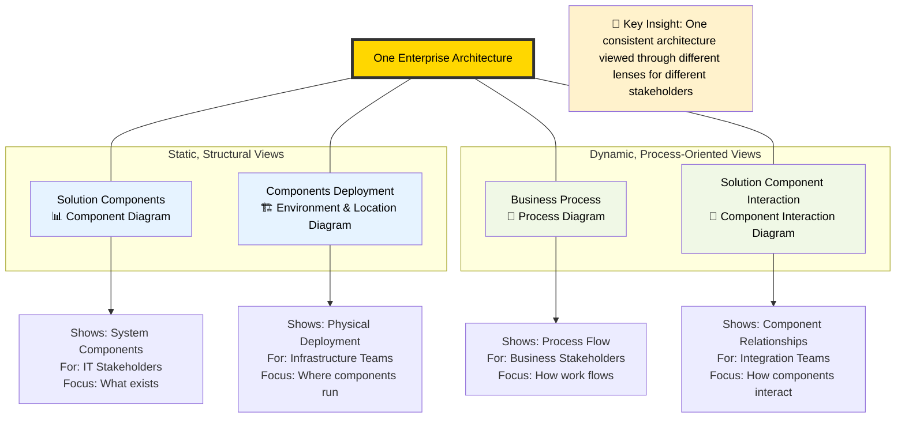

```mermaid
graph TD
    CENTER[One Enterprise Architecture]
    
    subgraph "Static, Structural Views"
        SC[Solution Components<br/>📊 Component Diagram]
        CD[Components Deployment<br/>🏗️ Environment & Location Diagram]
    end
    
    subgraph "Dynamic, Process-Oriented Views"
        BP[Business Process<br/>🔄 Process Diagram]
        CI[Solution Component Interaction<br/>🔗 Component Interaction Diagram]
    end
    
    CENTER --- SC
    CENTER --- BP
    CENTER --- CD
    CENTER --- CI
    
    SC --> SC1[Shows: System Components<br/>For: IT Stakeholders<br/>Focus: What exists]
    BP --> BP1[Shows: Process Flow<br/>For: Business Stakeholders<br/>Focus: How work flows]
    CD --> CD1[Shows: Physical Deployment<br/>For: Infrastructure Teams<br/>Focus: Where components run]
    CI --> CI1[Shows: Component Relationships<br/>For: Integration Teams<br/>Focus: How components interact]
    
    LEGEND[🎯 Key Insight: One consistent architecture viewed through different lenses for different stakeholders]
    
    style CENTER fill:#FFD700,stroke:#333,stroke-width:4px,color:#000
    style SC fill:#E6F3FF,color:#000
    style BP fill:#F0F8E6,color:#000
    style CD fill:#E6F3FF,color:#000
    style CI fill:#F0F8E6,color:#000
    style LEGEND fill:#FFF2CC,color:#000
```
