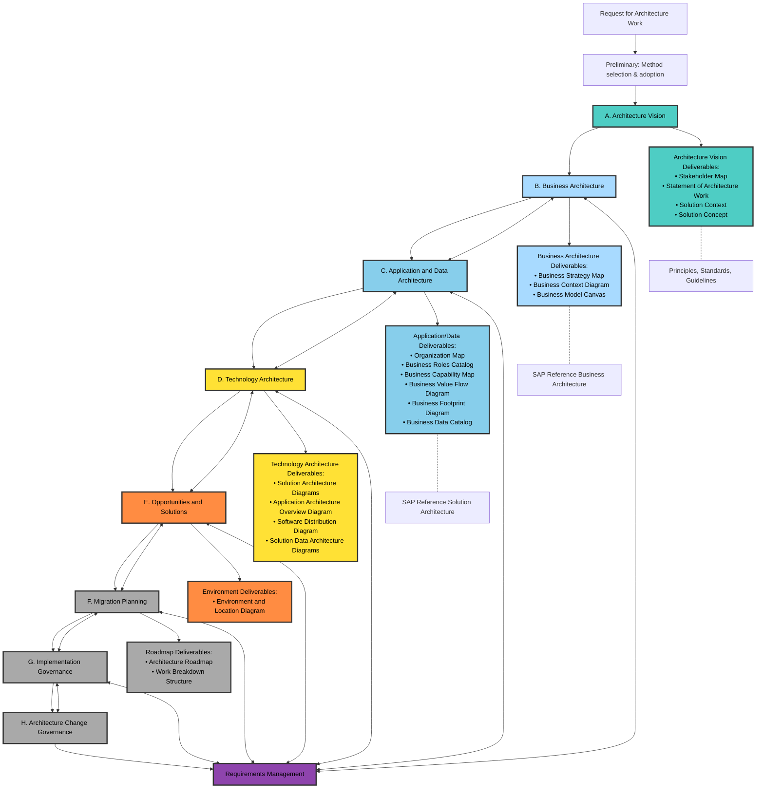

```mermaid
graph TD
    RFW[Request for Architecture Work] --> PMS[Preliminary: Method selection & adoption]
    
    PMS --> AV[A. Architecture Vision]
    AV --> BA[B. Business Architecture]
    BA --> ADA[C. Application and Data Architecture]
    ADA --> TA[D. Technology Architecture]
    TA --> OS[E. Opportunities and Solutions]
    OS --> MP[F. Migration Planning]
    MP --> IG[G. Implementation Governance]
    IG --> ACG[H. Architecture Change Governance]
    ACG --> RM[Requirements Management]
    
    %% Bidirectional connections
    BA <--> ADA
    ADA <--> TA
    TA <--> OS
    OS <--> MP
    MP <--> IG
    IG <--> ACG
    RM <--> BA
    RM <--> ADA
    RM <--> TA
    RM <--> OS
    RM <--> MP
    RM <--> IG
    
    %% Architecture Vision deliverables
    AV --> AVD[Architecture Vision Deliverables:<br/>• Stakeholder Map<br/>• Statement of Architecture Work<br/>• Solution Context<br/>• Solution Concept]
    
    %% Business Architecture deliverables
    BA --> BAD[Business Architecture Deliverables:<br/>• Business Strategy Map<br/>• Business Context Diagram<br/>• Business Model Canvas]
    
    %% Application/Data Architecture deliverables
    ADA --> ADAD[Application/Data Deliverables:<br/>• Organization Map<br/>• Business Roles Catalog<br/>• Business Capability Map<br/>• Business Value Flow Diagram<br/>• Business Footprint Diagram<br/>• Business Data Catalog]
    
    %% Technology Architecture deliverables
    TA --> TAD[Technology Architecture Deliverables:<br/>• Solution Architecture Diagrams<br/>• Application Architecture Overview Diagram<br/>• Software Distribution Diagram<br/>• Solution Data Architecture Diagrams]
    
    %% Environment deliverables
    OS --> ELD[Environment Deliverables:<br/>• Environment and Location Diagram]
    
    %% Roadmap deliverables
    MP --> RD[Roadmap Deliverables:<br/>• Architecture Roadmap<br/>• Work Breakdown Structure]
    
    %% Principles reference
    AVD -.- PSG[Principles, Standards, Guidelines]
    BAD -.- SRBA[SAP Reference Business Architecture]
    ADAD -.- SRSA[SAP Reference Solution Architecture]
    
    %% Styling
    classDef visionStyle fill:#4ECDC4,stroke:#333,stroke-width:3px,color:#000
    classDef businessStyle fill:#A8DAFF,stroke:#333,stroke-width:3px,color:#000
    classDef applicationStyle fill:#87CEEB,stroke:#333,stroke-width:3px,color:#000
    classDef technologyStyle fill:#FFE135,stroke:#333,stroke-width:3px,color:#000
    classDef environmentStyle fill:#FF8C42,stroke:#333,stroke-width:3px,color:#000
    classDef requirementsStyle fill:#8E44AD,stroke:#333,stroke-width:3px,color:#000
    classDef governanceStyle fill:#A9A9A9,stroke:#333,stroke-width:3px,color:#000
    classDef roadmapStyle fill:#D3D3D3,stroke:#333,stroke-width:3px,color:#000
    
    class AV,AVD visionStyle
    class BA,BAD businessStyle
    class ADA,ADAD applicationStyle
    class TA,TAD technologyStyle
    class OS,ELD environmentStyle
    class RM requirementsStyle
    class IG,ACG,MP,RD governanceStyle
```
