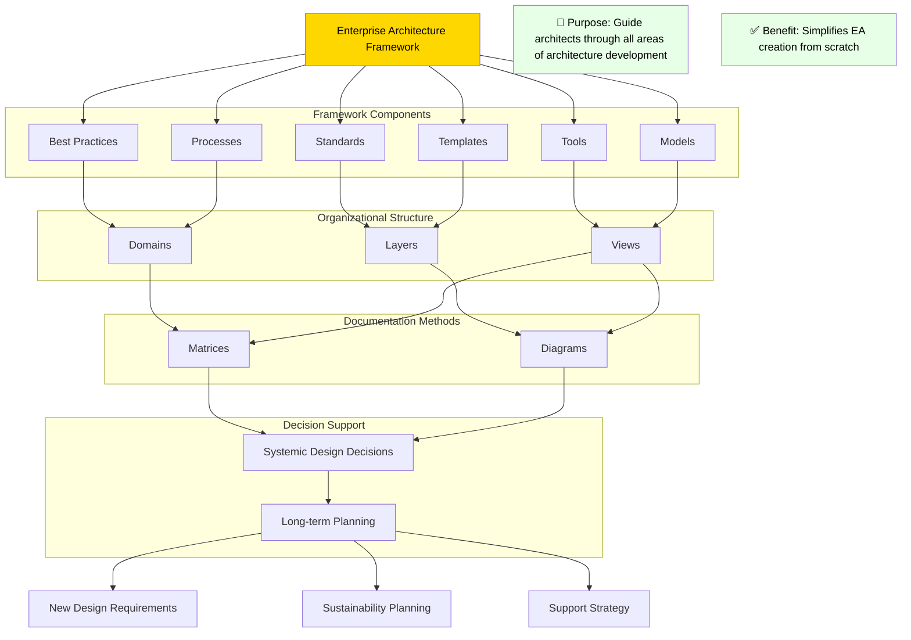

```mermaid
graph TB
    EAF[Enterprise Architecture Framework]
    
    subgraph "Framework Components"
        BP[Best Practices]
        ST[Standards]
        TO[Tools]
        PR[Processes]
        TE[Templates]
        MO[Models]
    end
    
    subgraph "Organizational Structure"
        DO[Domains]
        LA[Layers]
        VI[Views]
    end
    
    subgraph "Documentation Methods"
        MA[Matrices]
        DI[Diagrams]
    end
    
    subgraph "Decision Support"
        SYS[Systemic Design Decisions]
        LT[Long-term Planning]
    end
    
    EAF --> BP
    EAF --> ST
    EAF --> TO
    EAF --> PR
    EAF --> TE
    EAF --> MO
    
    BP --> DO
    ST --> LA
    TO --> VI
    PR --> DO
    TE --> LA
    MO --> VI
    
    DO --> MA
    LA --> DI
    VI --> MA
    VI --> DI
    
    MA --> SYS
    DI --> SYS
    SYS --> LT
    
    LT --> LT1[New Design Requirements]
    LT --> LT2[Sustainability Planning]
    LT --> LT3[Support Strategy]
    
    PURPOSE[🎯 Purpose: Guide architects through all areas of architecture development]
    BENEFIT[✅ Benefit: Simplifies EA creation from scratch]
    
    style EAF fill:#FFD700,color:#000
    style PURPOSE fill:#E6FFE6,color:#000
    style BENEFIT fill:#E6FFE6,color:#000
```
