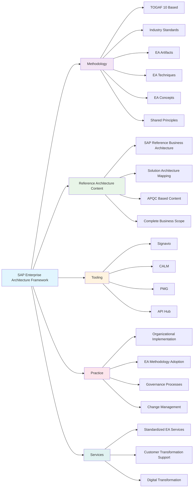

```mermaid
graph LR
    A[SAP Enterprise Architecture Framework] --> B[Methodology]
    A --> C[Reference Architecture Content]
    A --> D[Tooling]
    A --> E[Practice]
    A --> F[Services]
    
    B --> B1[TOGAF 10 Based]
    B --> B2[Industry Standards]
    B --> B3[EA Artifacts]
    B --> B4[EA Techniques]
    B --> B5[EA Concepts]
    B --> B6[Shared Principles]
    
    C --> C1[SAP Reference Business Architecture]
    C --> C2[Solution Architecture Mapping]
    C --> C3[APQC Based Content]
    C --> C4[Complete Business Scope]
    
    D --> D1[Signavio]
    D --> D2[CALM]
    D --> D3[PMG]
    D --> D4[API Hub]
    
    E --> E1[Organizational Implementation]
    E --> E2[EA Methodology Adoption]
    E --> E3[Governance Processes]
    E --> E4[Change Management]
    
    F --> F1[Standardized EA Services]
    F --> F2[Customer Transformation Support]
    F --> F3[Digital Transformation]
    
    style A fill:#e1f5fe
    style B fill:#f3e5f5
    style C fill:#e8f5e8
    style D fill:#fff3e0
    style E fill:#fce4ec
    style F fill:#e0f2f1
```
