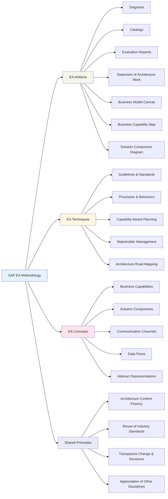

```mermaid
graph LR
    A[SAP EA Methodology] --> B[EA Artifacts]
    A --> C[EA Techniques]
    A --> D[EA Concepts]
    A --> E[Shared Principles]
    
    B --> B1[Diagrams]
    B --> B2[Catalogs]
    B --> B3[Evaluation Reports]
    B --> B4[Statement of Architecture Work]
    B --> B5[Business Model Canvas]
    B --> B6[Business Capability Map]
    B --> B7[Solution Component Diagram]
    
    C --> C1[Guidelines & Standards]
    C --> C2[Processes & Behaviors]
    C --> C3[Capability-based Planning]
    C --> C4[Stakeholder Management]
    C --> C5[Architecture Road Mapping]
    
    D --> D1[Business Capabilities]
    D --> D2[Solution Components]
    D --> D3[Communication Channels]
    D --> D4[Data Flows]
    D --> D5[Abstract Representations]
    
    E --> E1[Architecture Content Fluency]
    E --> E2[Reuse of Industry Standards]
    E --> E3[Transparent Change & Decisions]
    E --> E4[Appreciation of Other Disciplines]
    
    style A fill:#e3f2fd
    style B fill:#f1f8e9
    style C fill:#fff8e1
    style D fill:#fce4ec
    style E fill:#e8eaf6
```
