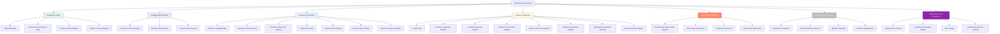

```mermaid
graph TD
    A[SAP EA Seven Domains] --> B[Architecture Vision]
    A --> C[Strategy and Motivation]
    A --> D[Business Architecture]
    A --> E[Solution Architecture]
    A --> F[Technology Architecture]
    A --> G[Roadmap and Transition]
    A --> H[Requirements and Governance]
    
    B --> B1[Stakeholder Map]
    B --> B2[Statement of Architecture Work]
    B --> B3[Solution Context Diagram]
    B --> B4[Solution Concept Diagram]
    
    C --> C1[Business Context Diagram]
    C --> C2[Business Strategy Map]
    C --> C3[Business Model Canvas]
    
    D --> D1[Business Capability Map]
    D --> D2[Business Process Catalog]
    D --> D3[Business Value Flow Diagram]
    D --> D4[Organization Map]
    D --> D5[Business Data Catalog]
    D --> D6[Business Role Catalog]
    D --> D7[Business Footprint Diagram]
    
    E --> E1[Product Map]
    E --> E2[Solution Component Diagram]
    E --> E3[Solution Value Flow Diagram]
    E --> E4[Solution Process Flow Diagram]
    E --> E5[Solution Data Flow Diagram]
    E --> E6[Software Distribution Diagram]
    E --> E7[Application Architecture Overview]
    E --> E8[Conceptual Data Diagram]
    
    F --> F1[Environments and Location Diagram]
    F --> F2[Technology Components]
    F --> F3[Hardware & Networks]
    F --> F4[Data Center Deployment]
    
    G --> G1[Architecture Roadmap]
    G --> G2[Work Breakdown Structure]
    G --> G3[Migration Planning]
    G --> G4[Transition Management]
    
    H --> H1[Requirements Catalog]
    H --> H2[Architecture Principles Catalog]
    H --> H3[Risk Catalog]
    H --> H4[Architectural Decision Catalog]
    
    style B fill:#e0f2f1
    style C fill:#e8eaf6
    style D fill:#e3f2fd
    style E fill:#fff8e1
    style F fill:#ff8a65,color:#fff
    style G fill:#bdbdbd,color:#fff
    style H fill:#8e24aa,color:#fff
```
