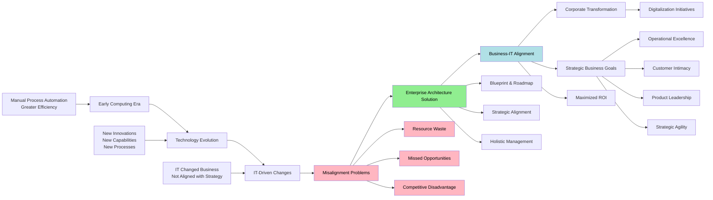

```mermaid
graph LR
    A[Early Computing Era] --> B[Technology Evolution]
    B --> C[IT-Driven Changes]
    C --> D[Misalignment Problems]
    D --> E[Enterprise Architecture Solution]
    E --> F[Business-IT Alignment]
    
    A1[Manual Process Automation<br/>Greater Efficiency] --> A
    
    B1[New Innovations<br/>New Capabilities<br/>New Processes] --> B
    
    C1[IT Changed Business<br/>Not Aligned with Strategy] --> C
    
    D --> D1[Resource Waste]
    D --> D2[Missed Opportunities]
    D --> D3[Competitive Disadvantage]
    
    E --> E1[Blueprint & Roadmap]
    E --> E2[Strategic Alignment]
    E --> E3[Holistic Management]
    
    F --> F1[Corporate Transformation]
    F --> F2[Strategic Business Goals]
    F --> F3[Maximized ROI]
    
    F1 --> F1a[Digitalization Initiatives]
    F2 --> F2a[Operational Excellence]
    F2 --> F2b[Customer Intimacy]
    F2 --> F2c[Product Leadership]
    F2 --> F2d[Strategic Agility]
    
    style D fill:#FFB6C1,color:#000
    style D1 fill:#FFB6C1,color:#000
    style D2 fill:#FFB6C1,color:#000
    style D3 fill:#FFB6C1,color:#000
    style E fill:#90EE90,color:#000
    style F fill:#B0E0E6,color:#000
```
